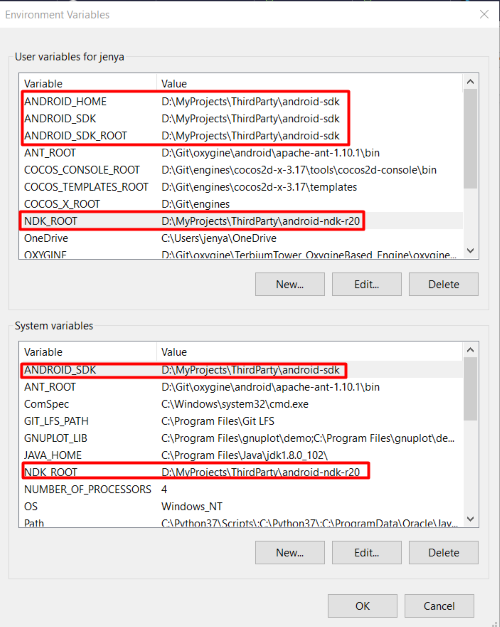
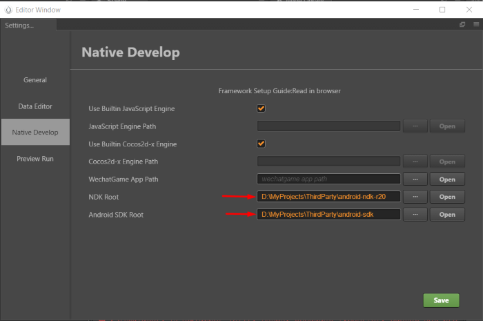
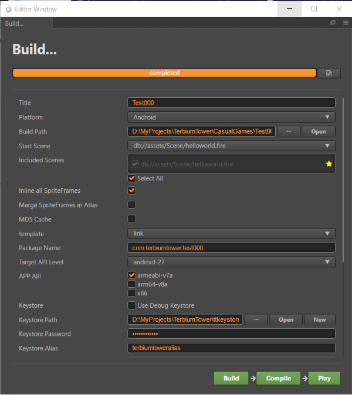

Template project made with Cocos Creator

1. Open setup.bat
2. Wait until all resources downloaded
3. Setup Cocos Creator in CocosCreator folder
4. Set marked Environment Variables on your computer:

5. In Cocos Creator File->Settings->Native Develop set ndk and sdk paths downloaded earlier:

6. When publishing app, set next settings: 

